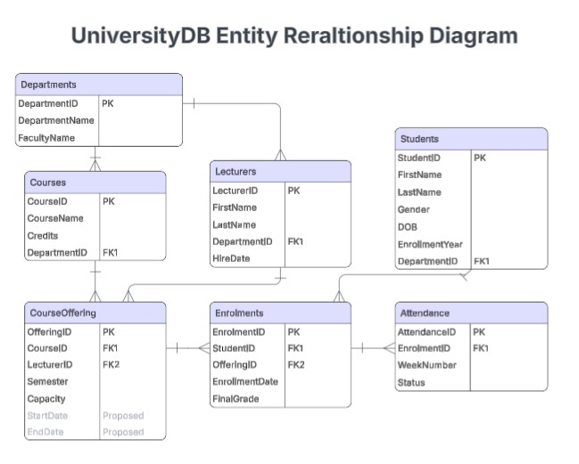

# UniversityDB_SQL_SMSS
A structured SQL Server database designed to model a university environment, including students, lecturers, courses, enrolments, attendance, and grading. This project demonstrates database design, analytical SQL, and reporting queries 

## Project Overview
UniversityDB simulates a real university information system with:

- Student and lecturer management
- Course and department structure
- Course offerings across semesters
- Enrolments and final grades
- Attendance tracking
- Analytical queries (GPA, attendance %, risk detection, rankings)

The database is fully script‑generated and can be recreated using the UniversityDB.sql file in the main folder. It can also be recreated from scratch using the SQL setup scripts located in the SQL_Queries_01_DB_Setup folder.

Note: Some future queries reference columns such as StartDate and EndDate in CourseOfferings.
These columns are not yet implemented. The queries are stored for future use and will run once the schema is updated.

## Database Schema (Summary)
The core tables include:
- Students
- Lecturers
- Departments
- Courses
- CourseOffering
- Enrolments
- Attendance
- GradeScale
- Terms (This table has been added recently and is still being developed)

## Purpose of This Project
This database is designed for:
- SQL learning and practice
- Portfolio demonstration
- Academic coursework
- Data analytics exercises

  
## Entity Relationship Diagram 
This Entity Relationship Diagram (ERD) was designed in Lucidchart.

